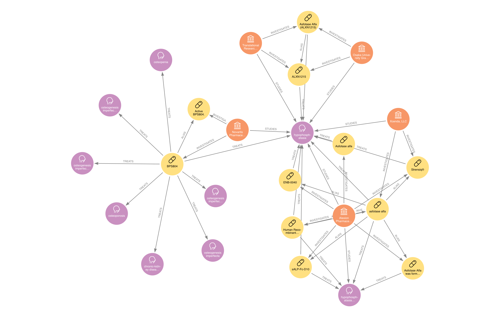

# Clinical Trial GraphDB Overlay Project
****
## Table of Contents
- [Clinical Trial GraphDB Overlay Project](#clinical-trial-graphdb-overlay-project)
  - [Table of Contents](#table-of-contents)
  - [1. Purpose](#1-purpose)
  - [2. Target Audiences](#2-target-audiences)
    - [**2.1 Doctors**](#21-doctors)
    - [**2.2 Researchers/P.I.**](#22-researcherspi)
    - [**2.3 Pharmaceuticals Companies**](#23-pharmaceuticals-companies)
    - [**2.4 Equity Analyst**](#24-equity-analyst)
  - [3. Sample Queries](#3-sample-queries)
    - [3.1 SPONSOR MAP **ImmunoGen, Inc.**](#31-sponsor-map-immunogen-inc)
    - [3.2 CONDITION MAP **Wilson Disease**](#32-condition-map-wilson-disease)
    - [3.3 STUDY on INTERVENTION **Ultomiris** - (Active Clinical Trials highlighted)](#33-study-on-intervention-ultomiris---active-clinical-trials-highlighted)
    - [3.4 Find Competition on INTERVENTION **Eculizumab** ON CONDITION **pnh**](#34-find-competition-on-intervention-eculizumab-on-condition-pnh)
    - [3.5 SPONSORS on CONDITION **ALS** - (Industry Sponsor highlighted)](#35-sponsors-on-condition-als---industry-sponsor-highlighted)
    - [3.6 CONDITION Shares INTERVENTION with CONDITION **hypophosphatasia**](#36-condition-shares-intervention-with-condition-hypophosphatasia)
  - [4. Data Schema](#4-data-schema)
    - [4.1 Nodes:](#41-nodes)
    - [4.2 Relationships:](#42-relationships)
  - [5. Sources](#5-sources)
  - [6. System Setup](#6-system-setup)
  - [7. Development Plan](#7-development-plan)
****

## 1. Purpose

The project aims to overlay the ClinicalTrials.org database into a graphDB for analyzing unique relationships between the PIs, Research Facility, Sponsors, Study, Intervention and Disease Area. Compared to regular relational database (SQL), graphDB allows for better representation of business relationships within the  dataset. The graphDB will make insights on competition, overlap of treatment or disease, trends and saturation of disease area much easier and faster to analyze. 
****

## 2. Target Audiences

### **2.1 Doctors**

Doctors can use the database to search for [potential interventions for their patients](#32-condition-map-wilson-disease), [explore off-label uses of existing interventions](#36-condition-shares-intervention-with-condition-hypophosphatasia), and [active clinical trials](#33-study-on-intervention-ultomiris---active-clinical-trials-highlighted). 

### **2.2 Researchers/P.I.**

Researchers and Principal Investigators can use the database to search for [collaborative relationships between sponsors](#32-condition-map-wilson-disease) and look for potential future collaborations with [sponsors that studies a particular condition.](#35-sponsors-on-condition-als---industry-sponsor-highlighted)

### **2.3 Pharmaceuticals Companies**

Pharmaceuticals can use the database to look at the [saturation of the treatment options](#32-condition-map-wilson-disease), [keep track of competitive landscape](#34-find-competition-on-intervention-eculizumab-on-condition-pnh), identify if [new clinical trial for off-label use of the pharmaceutical's or competitors' intervention has been initiated](#36-condition-shares-intervention-with-condition-hypophosphatasia). Furthermore, Pharmaceutical companies can look for [potential collaborative relationships or avoid sponsors based on other sponsor's past relationship and acitivites](#35-sponsors-on-condition-als---industry-sponsor-highlighted).

### **2.4 Equity Analyst**

Equity Analyst can explore the [activites of a particular sponsor](#31-sponsor-map-immunogen-inc), [competitive landscape for the condition](#34-find-competition-on-intervention-eculizumab-on-condition-pnh) and look at the [saturation of treatment options for a condition](#34-find-competition-on-intervention-eculizumab-on-condition-pnh) as they develope through the years.

## 3. Sample Queries
*All samples have limited number of nodes to increase performance and may not have all relationships and nodes*

***See Example 3.2 for a sample of a JSON output***

### 3.1 SPONSOR MAP **ImmunoGen, Inc.**

>Shows all Studies, Treatment and Conditions the company is exploring. 


```Cypher
MATCH pattern=(sponsor:SPONSOR)-[:STUDIES]->(:CONDITION)<-[:TREATS]-(intervention:INTERVENTION)-[:EVALUATES]-(:STUDY)<-[]-(sponsor)
WHERE sponsor.name=$name
WITH pattern, intervention, sponsor
MATCH alias_pattern=(intervention)-[:ALIAS]-(:INTERVENTION)<-[]-(sponsor)
RETURN pattern, alias_pattern
```
### 3.2 CONDITION MAP **Wilson Disease**

>Identify Sponsors that are studying the disease as well as Interventions that are used to treat the disease.


Query
```Cypher
MATCH p=(sponsor:SPONSOR)-[:STUDIES]->(condition:CONDITION)<-[:TREATS]-(intervention:INTERVENTION {type: 'Drug'})-[:ALIAS]-(intervention_alias:INTERVENTION)<-[:INVESTIGATES]-(sponsor)
WHERE toLower(condition.name) in [$name] and intervention.isPlacebo is NULL and intervention_alias.isPlacebo is NULL
RETURN p 
```

Output
```Json
{
    "start": {
        "identity": 24946,
        "labels": [
            "SPONSOR"
            ],
        "properties": {
            "agency_class": "OTHER",
            "sponsorId": "2560",
            "name": "University of Michigan"
            }
    },
    "end": {
        "identity": 28572,
        "labels": [
            "INTERVENTION"
            ],
        "properties": {
            "InterventionId": "2364",
            "name": "Prednisone",
            "type": "Drug"
            }
    },
    "segments": [
        {
        "start": {
            "identity": 24946,
            "labels": [
                    "SPONSOR"
                    ],
            "properties": {
            "agency_class": "OTHER",
            "sponsorId": "2560",
            "name": "University of Michigan"
                    }
            },
        "relationship": {
            "identity": 3078410,
            "start": 24946,
            "end": 54833,
            "type": "STUDIES",
            "properties": {

                    }
                },
        "end": {
            "identity": 54833,
            "labels": [
                    "CONDITION"
                    ],
            "properties": {
            "name": "wilson disease",
            "ConditionId": "98186"  
                    }
            }   
        },
        {
        "start": {
            "identity": 54833,
            "labels": [
                    "CONDITION"
                    ],
            "properties": {
            "name": "wilson disease",
            "ConditionId": "98186"
                    }
        },
        "relationship": {
            "identity": 6418669,
            "start": 47737,
            "end": 54833,
            "type": "TREATS",
            "properties": {
            "occurance": 1
                    }
        },
        "end": {
            "identity": 47737,
            "labels": [
                    "INTERVENTION"
                    ],
            "properties": {
            "InterventionId": "5149",
            "name": "prednisolone",
            "type": "Drug"
                    }
        }
        },
        {
        "start": {
            "identity": 47737,
            "labels": [
                    "INTERVENTION"
                    ],
            "properties": {
            "InterventionId": "5149",
            "name": "prednisolone",
            "type": "Drug"
                    }
        },
        "relationship": {
            "identity": 24225,
            "start": 28572,
            "end": 47737,
            "type": "ALIAS",
            "properties": {

                    }
        },
        "end": {
            "identity": 28572,
            "labels": [
                    "INTERVENTION"
                    ],
            "properties": {
            "InterventionId": "2364",
            "name": "Prednisone",
            "type": "Drug"
                    }
        }
        },
        {
        "start": {
            "identity": 28572,
            "labels": [
                    "INTERVENTION"
                    ],
            "properties": {
            "InterventionId": "2364",
            "name": "Prednisone",
            "type": "Drug"
                    }
        },
        "relationship": {
            "identity": 1422928,
            "start": 24946,
            "end": 28572,
            "type": "INVESTIGATES",
            "properties": {
            "occurance": 1
                    }
        },
        "end": {
            "identity": 24946,
            "labels": [
                    "SPONSOR"
                    ],
            "properties": {
            "agency_class": "OTHER",
            "sponsorId": "2560",
            "name": "University of Michigan"
                    }
        }
        }
    ],
    "length": 4.0
}
```

### 3.3 STUDY on INTERVENTION **Ultomiris** - (Active Clinical Trials highlighted)

>Shows clincial trials (Studies) that are evaluating the Intervention.


```Cypher
MATCH pattern = (study:STUDY)-[:EVALUATES]->(intervention)-[:ALIAS]- (intervention_alias:INTERVENTION)<-[:EVALUATES]-(study_alias:STUDY)
WHERE intervention.name = $name and study.phase IS NOT NULL 
RETURN pattern
```

### 3.4 Find Competition on INTERVENTION **Eculizumab** ON CONDITION **pnh**


>Shows all Interventions being used to treat a Condition. You can also remove Condition filter to show competition of all Conditions being treated by the Intervention


```Cypher
MATCH pattern = (intervention:INTERVENTION)-[:TREATS]->(condition:CONDITION)
WHERE toLower(intervention.name) CONTAINS toLower($intname) and toLower(condition.name) CONTAINS toLower($cond_name)
WITH pattern, intervention, condition
MATCH pattern_2=(intervention)-[:ALIAS]-(intervention_alias:INTERVENTION)-[:TREATS]->(condition)<-[:TREATS]-(competition:INTERVENTION)-[:ALIAS]-(:INTERVENTION)-[:TREATS]->(condition)
WHERE intervention.isPlacebo IS NULL and intervention_alias.isPlacebo IS NULL
RETURN pattern, pattern_2
```


### 3.5 SPONSORS on CONDITION **ALS** - (Industry Sponsor highlighted)

>Shows all Sponsors that are exploring a Condition and any relationship between the Sponsors (Color indicates the SPONSOR is an INDUSTRY, ie pharmaceutical company)


```Cypher
MATCH p=(sponsor:SPONSOR)-[:STUDIES]->(condition:CONDITION)<-[:STUDY_ON]-(study:STUDY)
WHERE toLower(condition.name) in [$name] 
WITH sponsor, condition
MATCH p2 = (sponsor)-[:COLLABORATES_WITH]-(co_sponsor:SPONSOR)-[:STUDIES]->(condition)
RETURN p2
```

### 3.6 CONDITION Shares INTERVENTION with CONDITION **hypophosphatasia**

>Identify Conditions that are being treated with the Intervention of HPP. This could potentially allow you to identify additional indications that an intervention could be used



```Cypher
MATCH p=(sponsor:SPONSOR {agency_class:'INDUSTRY'})-[:STUDIES]->(condition:CONDITION)<-[treats_rel:TREATS]-(intervention:INTERVENTION {type: 'Drug'})
WHERE toLower(condition.name) in [$name] and intervention.isPlacebo IS NULL
WITH intervention, p, sponsor
MATCH p2=(sponsor)-[:INVESTIGATES]->(intervention)-[:TREATS]->(cond:CONDITION)
RETURN p, p2
```
****

## 4. Data Schema


### 4.1 Nodes:
|# | Label | Properties| Type |
|--|-------|------------|-------|
|1| Study | ||
|||ID |Integer|
|||completion_date|Date|
|||created_at|DateTime|
|||nct_id|String|
|||official_title|Text|
|||overall_status|String|
|||phase | String|
|||source | String|
|||start_date| Date|
|||studyId | Integer|
|||updated_at | DateTime|
|2|Sponsor||||
|||SponsorId| Integer|
|||name|String|
|||sponsorId|Integer|
|3|Facility*|||
|4|PI*|||
|5|Intervention|||
|||InterventionId|Integer|
|||name|String|
|||type|String|
|6|Condition|||
|||ConditionId|Integer|
|||name|String|
|7|Disease Area*||
|8|Region*|||

   
### 4.2 Relationships:
|#|Relationship Name|Originating Node|Target Node|Preferred Search Direction|Relationship Type|Properties|Data Type|
|-|--------|--------|------|------|-----|----|---|
|1|STUDY_ON|Study|Condition|Unidirectional|Direct||
|2|EVALUATES|Study|Intervention|Unidirectional|Direct|||
|3|LEADS|Sponsor|Study|Unidirectional|Direct|||
|4|COLLABORATES_ON|Sponsor|Study|Unidirectional|Direct||
|5|COLLABORATES_WITH|Sponsor|Sponsor|Bidirectional|Indirect||
|||||||occurance|Integer|
|6|STUDIES|Sponsor|Condition|Unidirectional|Direct||
|||||||occurance|Integer|
|7|INVESTIGATES|Sponsor|Intervention|Unidirectional|Direct||
|||||||occurance|Integer|
|8|TREATS|Intervention|Condition|Unidirectional|Direct||
|||||||occurance|Integer|
|9|ALIAS|Intervention|Intervention|Bidirectional|Direct/Indirect|||

> Direct Relationship indicates relationship built into the SQL database's schema

> Indirect Relationship indicates relationship that was inferred based on the relationship the node has with one or more nodes


****

## 5. Sources

ClinicalTrials.org : Information on clinical trials

Proprietary Dataset : Additional contextual datasets are used to clean and tag the ClinicalTrials.org database to build relationships and speedup query

International Classification of Disease (ICD)* : Classify conditions

****

## 6. System Setup 
1. SQL Database : PostGRE SQL
2. GraphDB : Neo4j
3. DB Conversion Algorithem : Proprietary
4. Analytics Engine : Proprietary
5. Visualization Platform : Neo4j Bloom

****

## 7. Development Plan
1. Prototype - (COMPLETED)

ClinicalTrials.org SQL database to be mapped into a graphDB.

2. V.1 - (IN PROGRESS)

Proprietary data and tagging to be added to improve performance and ease of search.

3. V.2

NLP implemented to clean the ClinicalTrails.org data further

FDA's Device and Drug database to be overlayed on INTERVENTION for additional context

ICD database is overlayed on top of the CONDITION nodes to better group the disease groups

4. V.3

Bloomberg BI database to be overlayed on top of the Sponsor/Intervention data to better contextualize drug development and analyst expectations on individual drugs