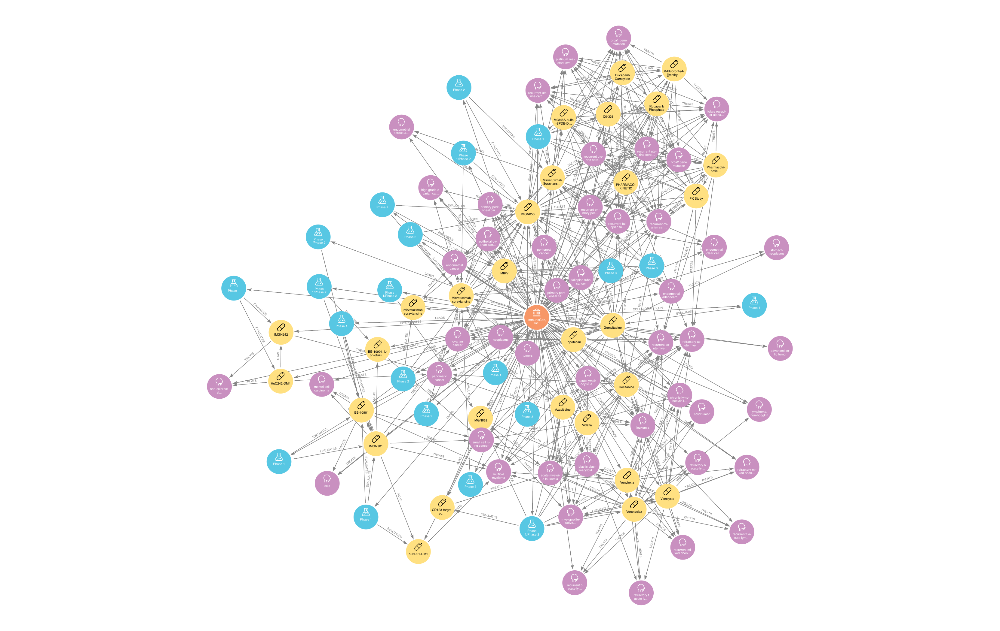
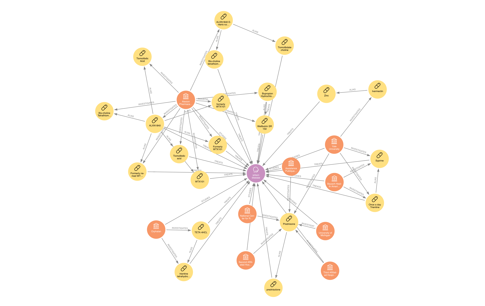
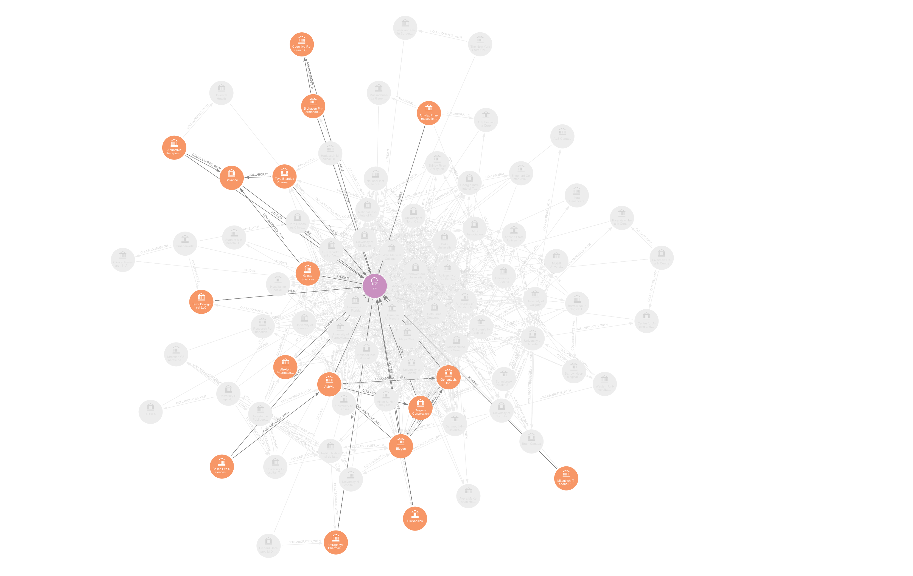
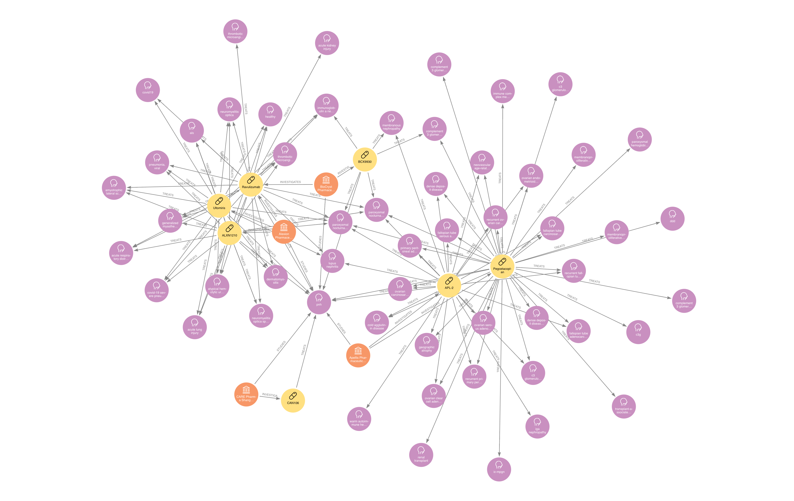

# Clinical Trial GraphDB Overlay Project
****
## 1. Purpose

The project aims to overlay the ClinicalTrials.org database into a graphDB for analyzing unique relationships between the PIs, Research Facility, Sponsors, Study, Intervention and Disease Area. Compared to regular relational database (SQL), graphDB allows for better representation of business relationships within the  dataset. The graphDB will make insights on competition, overlap of treatment or disease, trends and saturation of disease area much easier and faster to analyze. 
****
## 2. Sources

ClinicalTrials.org : Information on clinical trials

Proprietary Dataset : Additional datasets are used to clean and tag the ClinicalTrials.org database to build relationships and speedup query

International Classification of Disease (ICD)* : Classify conditions

****
## 3. Data Schema

### Nodes:
1. Study

   
2. Sponsor
   
3. Facility*
   
4. PI*
   
5. Intervention
   
6. Condition
   
7. Disease Area* 
    
8. Region*

   
### Relationships:
1. STUDY - [:STUDY_ON] -> CONDITION : Direct Relationship

2. STUDY - [:EVALUATES] -> INTERVENTION : Direct Relationship

3. SPONSOR - [:LEADS] -> STUDY : Direct Relationship

4. SPONSOR - [:COLLABORATES_ON] -> STUDY : Direct Relationship

5. SPONSOR - [:COLLABORATES_WITH] -> SPONSOR : Indirect Relationship

6. SPONSOR - [:STUDIES] -> CONDITION : Direct Relationship

7. SPONSOR - [:INVESTIGATES] -> INTERVENTION : Direct Relationship

8. INTERVENTION - [:TREATS] -> CONDITION : Direct Relationship

9.  INTERVENTION - [:ALIAS] -> INTERVENTION : Direct/Indirect Relationship

> Direct Relationship indicates relationship built into the SQL database's schema

> Indirect Relationship indicates relationship that was inferred based on the relationship the node has with one or more nodes

****

## 4. Sample Queries
*All samples have limited number of nodes to increase performance and may not have all relationships and nodes*

### SPONSOR MAP **ImmunoGen, Inc.**

Shows all Studies, Treatment and Conditions the company is exploring

### CONDITION MAP **Wilson Disease**

Identify Sponsors that are studying the disease as well as Interventions that are used to treat the disease.

### STUDY on INTERVENTION **Ultomiris** - (Active Clinical Trials highlighted)

Shows clincial trials (Studies) that are being used to evaluate the Intervention.

### Find Competition on INTERVENTION **Eculizumab** ON CONDITION **pnh**

Shows all Interventions being used to treat a Condition. You can also remove Condition filter to show competition of all Conditions being treated by the Intervention

### SPONSORS on CONDITION **ALS** - (Industry Sponsor highlighted)

Shows all Sponsors that are exploring a Condition and any relationship between the Sponsors (Color indicates the SPONSOR is an INDUSTRY, ie pharmaceutical company)

### CONDITION Shares INTERVENTION with CONDITION **pnh**

Identify Conditions that are being treated with the Intervention of PNH. This could potentially allow you to identify additional indications that an intervention could be used

****

## 5. System Setup 
1. SQL Database 
2. GraphDB
3. DB Conversion **Algorithm**
4. Analytics Engine

   